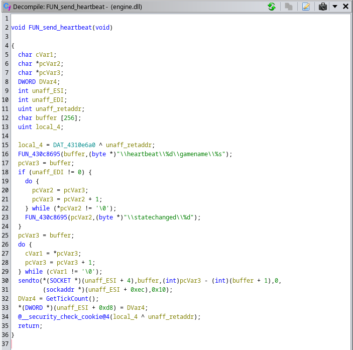
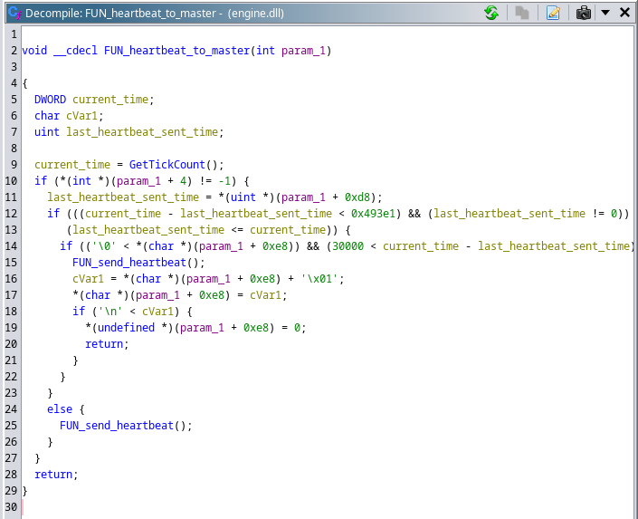

# NightfireSpy: open-source implementation of GameSpy's *James Bond 007: Nightfire* master server

### *Note: this project is a work in progress, as reverse engineering is moving on, the codebase is updated, the first fully working version will be made into a 0.1 release. Check [current project status](#current-status)*

## Background

*James Bond 007: Nightfire* is a FPS game released by EA Games in 2002. The game offers both
singleplayer and multiplayer mode. The multiplayer mode allows the player to create a gameserver
with preferred settings (map, CTF/DM mode, max players, password) which is displayed in the
server list of other players who can in turn join it. This in-game server creation would later
be augmented with community-developed dedicated server options with more advanced server
configurations such as map rotations, IP ban and even an anti-cheat system.

When the players choose the multiplayer mode, the server list provides them with a choice of
gameservers to join. The way this works is, in simple terms, that the gameserver on creation
registers onto the master server (and in regular periods sends heartbeats) upon which it gets
added to its list of active gameservers. The client (player) authenticates onto the master
server and requests a list of gameservers which gets servered and which it in turn parses
and displayes in the game menu.

The master server system described above was developed and maintained by GameSpy, a company
which was acquired by Glu Mobile in 2012 and [announced the shutdown of its entire master
server infrastructure in 2014](https://web.archive.org/web/20230517215936/https://www.polygon.com/2014/4/3/5579254/gamespy-technology-shutdown-date-multiplayer-server-hosting-matchmaking).
This suddenly left many of the games that it served to die a slow death as players
were suddenly unable to get any servers listed. The only available option was to directly
enter the IP:port value of a known gameserver host.

The aim of this project is to learn more about the GameSpy's master server implementation,
specifically for 'James Bond: Nightfire', offer anyone the ability to host one, but also
to allow other GameSpy-dependent games to fork and implement their own variants.

## Protocol details & reverse-engineering

'James Bond: Nightfire' is developed on the GoldSrc engine, which in turn is based on
Quake3 engine. This is useful since Quake3 was open-sourced but GoldSrc remains close
sourced and thus some information about the protocols that's shared between the two
can be inferred. The rest is reverse-engineered through Wireshark capture dumps back
when the master server was still alive combined with engine decompilation using
Ghidra.

### Gameserver (query) protocol

The gameserver<->master communication is pretty straightforward and can be, for the
most part understood simply from Wireshark captures since it's completely unencrypted.
Basically, the gameserver sends a heartbeat to the master in the form of a packet like
'\\heartbeat\\6556\\gamename\\jbnightfire\\statechanged\\1'. What can be easily seen is that
the packet contains key-value pairs separated by the '\\' delimiter. In the case of the
heartbeat packet, the keys would be:

- heartbeat: query port number

- gamename: short name of the game assigned by GameSpy

- statechanged: true/false flag indicating update to configuration from last heartbeat

The protocol used to communicate the queries is UDP, thus connectionless and the master
server can receive these in any order on the same port from a variety of different
gameservers, which is important to keep in mind when designing the system. Another
important consideration is at which frequency should the master server expect these
queries from a gameserver. This can be answered with a little bit of help from Ghidra:

Ghidra's ability to decompile assembly to C and search string and refernces greatly
simplifies reverse engineering. Here a function can be easily found by searching
references to the '\\heartbeat\\' string. We can observe that this is the function that
stores the heartbeat string into the buffer and the sends it over UDP (sendto). I simply
named this function 'FUN_send_heartbeat()' as that's its purpose in simplest terms.

Now, we're interested to see where does this get called from, thus simply by searching
for references to the function, we can find the calling function which I renamed to
'FUN_heartbeat_master()'. This function calls [GetTickCount()](https://learn.microsoft.com/en-us/windows/win32/api/sysinfoapi/nf-sysinfoapi-gettickcount)
to get the number of ticks of system uptime. It then verifies whether the heartbeat
was ever sent previously and if not, it immediately sends one (this is done when the
gameserver is started). It will keep sending so each 30000ms, or simply 30 seconds, until
the master server responds with a '\\status\\' packet.

Once the master receives the heartbeat, it issues a '\\status\\' packet back to the gameserver's
query port. The gameserver in turn responds with information about its configuration and status
(current map, gamemode, game version, max players limit, etc.). Afterwards, the gameserver will
continue sending heartbeats at a longer interval (5 minutes) with no "\\statechanged\\1", indicating
that the server configuration is unchanged. It is entirely the duty of the gameserver to
keep notifying the master that it's still alive and prevent the master from removing it from
the list.

### Client protocol

When we discuss clients in this document, we really mean 'players' in the broad sense of the word.
As already described in the introduction, clients need the master server to provide them with a list
of gameservers to browse and join. This communication goes over a separate port and uses TCP. The
reason to choose a stateful protocol is probably due to need to track the well-defined connection
flow from establishing to closing. Indeed, the simple description of this would be:

1. Client opens TCP connection to master server's client handling port
2. Master accepts the connection and sends a packet which looks like '\\basic\\\\secure\\KGVCQR\\'
3. Client uses the challenge in the master's packet to generate a response which looks like
   '\\gamename\\jbnightfire\\gamever\\1\\location\\0\\validate\\203q7t2w\\enctype\\2\\final\\\\queryid\\1.1\\'
4. Client issues a packet demanding a server list which looks like:
   '\\list\\\\gamename\\jbnightfire\\final\\' for a standard list request or
   '\\list\\cmp\\gamename\\jbnightfire\\final\\' for a compact list request
5. Master responds with encrypted list of PORT:IP combinations depending on the type of
   the server list requested (see [a chapter on server list types](#server-list-type))
6. Connection is closed

The strings in the packets indeed resemble the query strings, but the big different is that
the protocol both requires authentication as well as that the server list is sent encrypted.
Most likely, this was GameSpy's attempt to limit spamming the server with requests from
third-party server browsers or just plain spammers/DoS trolls. The 6 byte challenge is randomly
generated by the master and sent to the client which in turn uses the gamekey (predefined
string assigned by GameSpy) to generate a secure 'validate' key (or shortened, 'seckey') which
authenticates to the master. The master uses the 'enctype' information to encrypt the IP:port
server list separated by the '\\' delimiter. The same gamekey is used to encrypt this payload,
thus the client can decrypt it and query the gameservers directly. The seckey/enctype algorithms
were first reverse-engineered by Luigi Auriemma whose [site serves great resources regarding these
algorithms](http://aluigi.altervista.org/papers.htm#gsmsalg).

#### Server list type

When discussing the details of the client protocol above, it's important to understand how
the server list itself is serialized in order to be sent to the client.

The first and most simple is the standard list type which is requested when the client sends
the empty "\\list\\" parameter in the query. This server list is encoded as entries which have
the format of *"\\ip\\IP1.IP1.IP1.IP1:PORT1\\"*. At the end of the list comes the "\\final\\". This
format is useful for applications which want to print the IP:port combinations, such as online
server browsers, since it doesn't require conversion from raw bytes to ASCII string representations,
the connection URL can thus be easily formed that the player can click on and join the game.

The second and more complex is the compact list type which is requested when the client sends
the "cmp" value for the "\\list\\" parameter. This list type was probably used both to quickly
populate the appropriate structs for IPs (i.e. in_addr_t) and ports as well as to reduce the
amount of traffic from the master server to the clients. The IP and port bytes are transmitted
in network order. Each entry is encoded as *4bytes_of_ip|2bytes_of_port*. Just like the standard
list type, this one too end with "\\final\\". The in-game server list browser uses this list type
exclusively.

## System design

The NightfireSpy implementation of the master server uses three main components which will be
described in the following sections.

### Gameserver handler

This is a dedicated thread that handles all the communication from the gameservers. As mentioned
above, these will arrive in 'random' fashion from multiple host machines and ports via UDP
packets. Thus, a single socket is used to receive them, each of which is in turn processed to
validate the packet and extract server information from it. Each time a valid packet is received,
a timestamp is updated to keep track which is useful for the next section.

### Gameserver cleanup

This is a dedicated thread which loops over the list of currently tracked gameservers and checks
the last time each of them has properly communicated to the master. In case there was no communication
for time exceeding the period reverse-engineered above plus some margin, the server is removed from
the list. If it sends a valid heartbeat at a later time, it will be re-added just like when it
first registered.

### Client handlers

Clients' communication with the master is already discussed above. Since it's done over TCP, a reliable
stateful protocol and has well-defined communication stages, we need to keep track of it for each
individual client. This means each client will, upon its connection being accepted, be assigned its
own handler thread which which implements the state machine to go through all the connection stages.
The pooled threads pattern is used where a predefined number of threads (can be dimensioned according
to master's workload) is started upon which they block waiting for a client. Once the client gets added
to the queue and a unblock condition is broadcasted, the thread will lock the mutex, remove the client
from the queue and assign it to itself, after which the mutex will be unlocked. Now that the thread has
its client, it will go through all the connection stages before blocking again to wait for a new client.
If the client responds with an invalid packet (bad 'validate' seckey, invalid packet format, etc.) at
any stage of the connection, it will be immediately invalidated. Otherwise, the client is invalidated
when the final stage of the connection has been handled (sending of the server list). Once invalidated,
the state machine is exited, the socket closed and the client resources freed. Any future reqeuests from
the client will start at the first stage again and the state machine cycle repeats.

## Library API

The master server itself is implemented as a library (nfmaster.h) with a simple API consisting of only
three functions:

- **int32_t MasterSever_init(struct MasterServerNF \**master)**: initializes the resources needed for master's
  operation such as mutexes, lists and sockets. Returns zero on success, error code on failure. The handle
  argument will be initialized and populated on success and needs to be passed as argument to all future
  API calls.

- **int32_t MasterServer_start(struct MasterServerNF *master)**: starts the needed threads and begins accepting
  TCP client connection to be assigned to handler threads in the pool. This function is blocking and, as
  long as the server is running without faults, should never return. On returning, an error code would
  specify the reason why.

- **void MasterServer_free(struct MasterServerNF *master)**: this function performs a cleanup of all the
  resources used by the master, issues stop condition to the running threads and joins them, closes
  all the opened sockets, etc. This function should be called after MasterServer_start() exit control
  flow to ensure clean exit. Another good pattern is to call it from a signal handler, thus the application
  can exit gracefully when terminated via SIGINT for example.

## Current status

This section will temporarily describe the state of the project. At the moment, the basic
infrastructure has been written which:

- opens appropriate sockets for TCP and UDP communication of client and gameserver protocols

- client handler has been written for all connection stages supporting both server list types

- ported aluigi's seckey/enctype algorithm implementation

- gameserver heartbeat handling has been implemented

- implemented server cleanup

- top-level signal handler installed which allows for calling of MasterServer_free()
  API function and properly frees the resources, closes the sockets and stops and joins the
  threads.

### Verification status

- heartbeat and status processing verified by running a real Nightfire game server
- verified that the server is removed from the list after it's closed
- verified that the server list is correctly returned by testing with the original
  game executable and its in-game server list browser

